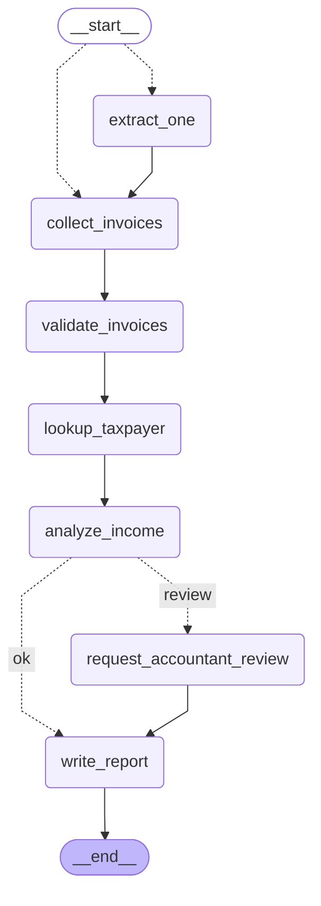

# Copiloto Monotributo

[](https://github.com/leonardoprimero/copiloto-monotributo/actions/workflows/ci.yml)

Un copiloto para monotributistas, hecho con LangGraph. Lee facturas con un
modelo, las verifica con código, y te dice en qué categoría te ubican tus
ingresos, cuánto margen te queda y qué tan cerca estás de quedar excluido del
régimen. Si algo no cierra, frena y le deja el caso a un contador, que puede
resolverlo más tarde desde otra máquina.

Se usa desde el navegador o desde la terminal:

```sh
uv sync
uv run copiloto serve        # http://127.0.0.1:8000
```

> **Aviso.** Este copiloto es orientativo y tiene fines informativos y educativos.
> No es asesoramiento impositivo ni legal, y no reemplaza a un contador matriculado.
> Nunca presenta trámites ante ARCA: no declara, no recategoriza y no hace ninguna
> gestión en tu nombre. Todas las facturas, CUIT y contribuyentes de este proyecto
> son sintéticos.

## Qué hace

1. **Lee** el texto de una factura y lo convierte en datos estructurados. Es el
   único paso donde participa un modelo.
2. **Verifica** con código: dígito verificador del CUIT, que los montos cierren,
   el precio unitario máximo, y que las fechas caigan dentro de la ventana móvil
   de doce meses.
3. **Consulta** la categoría registrada en un padrón de ARCA simulado.
4. **Analiza** los últimos doce meses: acumulado, categoría que corresponde,
   proyección al ritmo reciente, margen hasta cada tope y nivel de riesgo. Si
   declarás superficie, energía o alquileres, los evalúa contra la misma tabla:
   la categoría es la del parámetro más alto, como establece ARCA.
5. **Informa** — o frena y deriva el caso a un contador antes de cerrar. El
   caso queda guardado; el contador lo abre cuando puede, le pone el veredicto
   y recién ahí se escribe el informe.

## El grafo



Ese diagrama lo genera `scripts/export_graph.py` desde el grafo compilado, y un
test compara este bloque contra un render fresco. Un diagrama que puede
desincronizarse del código es peor que no tener diagrama.

| Nodo | Qué hace |
| --- | --- |
| `extract_invoices` | Llama al extractor una vez por factura. Si una no se puede leer, queda registrada como observación y el resto sigue. |
| `validate_invoices` | CUIT, montos, precio unitario máximo, fechas. Anota lo que no cierra. |
| `lookup_taxpayer` | Categoría registrada, desde el padrón simulado. Si no está, lo dice; nunca lo inventa. |
| `analyze_income` | Acumulado, categoría estimada, proyección, nivel de riesgo y motivos. |
| `request_accountant_review` | Pausa con `interrupt()` y espera a una persona. |
| `write_report` | Arma el informe. Las dos ramas terminan acá, así que un caso derivado también produce un documento. |

### Cuándo deriva a un contador

Hay dos motivos independientes:

- **Riesgo.** Cualquier nivel distinto de `low`: estar cerca de un tope, que la
  categoría ya no corresponda, una proyección que supere el régimen, ingresos
  por encima del tope máximo, un producto facturado por encima del precio
  unitario máximo, o un parámetro físico declarado que supere lo que admite la
  categoría registrada (medio) o el máximo del régimen (exclusión).
- **Dato dudoso.** Cualquier advertencia o error: un CUIT inválido, un total que
  no coincide con sus ítems, una fecha futura, una factura ilegible, un
  contribuyente que no está en el padrón, o directamente ninguna factura.

Las observaciones informativas —por ejemplo una factura fuera de la ventana— no
derivan por sí solas.

El contrato vive en `RiskPolicy.review_levels`, y los tests de ruteo corren
contra las dos lecturas posibles. Es una decisión de configuración, no una
regla soldada al código.

### Human in the loop

`request_accountant_review` llama a `interrupt()`. La ejecución se suspende, el
estado queda en un checkpoint, y la alerta aparece como `__interrupt__` en el
resultado del invoke. Quien llamó reanuda con `Command(resume={...})`, y ese
valor es lo que `interrupt()` devuelve dentro del nodo.

Un detalle define la forma de ese nodo: **al reanudar, se re-ejecuta desde la
primera línea.** Todo lo que esté antes de la pausa ocurre dos veces. Por eso el
nodo solo arma un payload puro antes de pausar, y escribe la decisión después de
la reanudación. `tests/graph/test_langgraph_api.py` fija ese comportamiento
contra el paquete instalado.

### El caso sobrevive al proceso

La pausa se escribe en un checkpoint. Con el checkpointer en memoria, el caso
vive lo que vive el proceso: suficiente para una demo que pregunta y reanuda en
la misma corrida. Con `--state-db` (o siempre, en la web) el checkpoint va a
SQLite, y reanudar es otra invocación del grafo sobre el mismo `thread_id`,
desde otro proceso, horas después.

`copiloto.service.Copilot` envuelve eso en cuatro operaciones —arrancar,
consultar, reanudar, listar— y la CLI y la web las usan por igual. El grafo
que reanuda no vuelve a pasar por `lookup_taxpayer` ni por `extract_invoices`:
sus resultados ya están en el checkpoint. Por eso ese grafo se arma con un
registro y un extractor que **fallan en voz alta** si alguien los consulta, en
vez de inventar una categoría que quien reanuda quizás no tiene a mano.

## Decisiones de diseño

**La IA lee, el código decide.** El modelo convierte texto en una factura y nada
más. Todo juicio —CUIT válido, montos coherentes, categoría, riesgo, qué rama
tomar— es código determinístico. Por eso toda la lógica fiscal se testea sin
modelo, sin clave y sin red, y por eso un resultado se puede discutir en vez de
tener que creerle.

**La tabla de ARCA es dato, no constante.** Cambia cada semestre, así que vive en
`config/monotributo_scales.json` con la URL de la fuente, la fecha de vigencia y
la fecha en que se consultó. Los montos se guardan como texto y se parsean a
`Decimal`: los topes tienen centavos y son inclusivos, así que un error de
redondeo de un float alcanza para mandar a alguien a la categoría equivocada.

**El extractor está detrás de un Protocol.** Tres implementaciones, un contrato.
El grafo no se entera de cuál hay abajo.

**Lo declarado se muestra como declarado.** Superficie, energía y alquileres
solo pueden venir del contribuyente. El informe los lista bajo “Parámetros
declarados” y aclara que nadie los verificó; lo que no se declara queda en “No
evaluado”, nunca se asume cero.

**El margen es la pregunta real.** Saber que estás en A no te dice qué hacer.
El informe dice cuánto podés facturar antes del tope de tu categoría y del
régimen, y cuántos meses te quedan al ritmo reciente. Esa cuenta de meses es
una heurística propia y el informe la declara como tal.

**Todo es sintético.** No hay una sola factura, CUIT ni contribuyente real en
este repositorio, y el proyecto nunca le pide credenciales de ARCA a nadie.

**El reloj se inyecta.** `today` es un parámetro en todos lados, así que los
resultados son reproducibles y los tests no caducan.

## Verificado contra

Nada de esto se escribió de memoria. Se verificó contra los paquetes instalados
y la fuente oficial el 2026-09-24:

| Pregunta | Respuesta |
| --- | --- |
| Versiones | `langgraph` 1.2.12, `langchain-core` 1.6.4, Python 3.12 |
| ¿`InMemorySaver` o `MemorySaver`? | Los dos se exportan y `MemorySaver is InMemorySaver`. Este proyecto usa `InMemorySaver`. |
| ¿Cómo se detecta la pausa? | `__interrupt__` en el resultado del invoke; el payload está en `result["__interrupt__"][0].value`. |
| ¿Al reanudar se re-ejecuta el nodo? | Sí, desde la primera línea. |
| ¿Los topes de ingresos dependen de la actividad? | No. La tabla publicada tiene una sola columna de ingresos brutos para A–K; la distinción entre servicios y venta de cosas muebles aparece solo en el monto mensual a pagar. |
| ¿`SqliteSaver` acepta el serializador propio? | Sí, por constructor: `SqliteSaver(conn, serde=...)`. `from_conn_string` no lo acepta, por eso la conexión se abre a mano. |
| ¿Un grafo nuevo sobre el mismo archivo reanuda la pausa de otro? | Sí. `tests/graph/test_checkpoints.py` arma dos grafos independientes sobre el mismo SQLite y el segundo cierra el caso del primero, con los tipos intactos. |

Python está fijado en 3.12 porque `langchain-core` advierte que los internals de
Pydantic V1 no son compatibles con Python 3.14 o superior.

## Qué NO evalúa

Sin declaraciones, la categoría estimada sale únicamente de los ingresos.
Superficie, energía y alquileres se evalúan **solo si los declarás**; si no,
quedan en la lista de no evaluado. Y hay causales que este proyecto no mira
nunca:

- cantidad de actividades y unidades de explotación
- gastos y adquisiciones no justificados
- las excepciones por tamaño de la localidad donde está el local

Por eso un riesgo bajo **no** es una verificación integral, y cada informe lo
aclara. La exclusión tiene causales que esta herramienta no revisa.

## Elegir un extractor

El extractor es el único componente donde participa un modelo. Se elige con
`COPILOTO_EXTRACTOR`:

| Modo | Para quién | Requisitos |
| --- | --- | --- |
| `fake` (default) | Tests y evals | Nada. Corre sin red. |
| `cli` | Cualquiera que ya tenga un CLI de IA instalado | El binario. **Sin API key** |
| `api` | Despliegues que producen informes a escala | `uv sync --extra api` y una clave de proveedor |

**El modo `cli`** le habla a la herramienta que ya usás. Resuelve en este orden:
`COPILOTO_EXTRACTOR_CMD` (cualquier comando, el prompt va por stdin), después
`COPILOTO_CLI` (un adaptador por nombre), y después autodetección sobre `codex`,
`claude`, `agy` y `gemini`. Si no resuelve ninguno falla con un mensaje que dice
qué hacer — **nunca** cae a `fake`, porque eso daría a entender que un modelo
leyó tus facturas cuando no las leyó nadie.

Esas cuatro invocaciones salieron del `--help` de cada herramienta, no de la
memoria de nadie. Cualquier otra herramienta entra por `COPILOTO_EXTRACTOR_CMD`.

**El modo `api`** es el código más corto, y vale notarlo:
`with_structured_output` hace que el proveedor garantice la forma de la
respuesta, así que buscar el JSON, validarlo y reintentar —todo lo que el modo
`cli` tiene que hacer a mano— directamente desaparece. El camino pago es más
fácil de programar que el gratis.

Todas las variables están en [docs/configuration.md](docs/configuration.md).

## Arranque rápido

Necesitás [uv](https://docs.astral.sh/uv/) y Python 3.12.

```sh
uv sync
uv run pytest                                   # 781 tests, sin red
uv run python -m copiloto.evals                 # 14 casos, sin red
```

Los extras son opcionales y nada del copiloto básico los necesita:

```sh
uv sync --extra ocr     # leer facturas escaneadas (además, instalá tesseract)
uv sync --extra arca    # consultar el padrón real (ver docs/arca-padron.md)
uv sync --extra api     # extraer con una API de proveedor
```

### Desde el navegador

```sh
uv run copiloto serve
```

Abre `http://127.0.0.1:8000`. Si tenés una herramienta de IA instalada (`codex`,
`claude`, `agy` o `gemini`), el servidor la detecta automáticamente y arranca
en modo `cli` listo para procesar facturas reales sin configurar nada. Si no
tenés ninguna instalada, arranca en modo `fake` para explorar los ejemplos.

La página de inicio tiene el formulario para tus facturas, los catorce ejemplos
para probar sin modelo, y la lista de casos con su estado. Un caso derivado es
una URL: el contador la abre cuando puede, ve la alerta con el margen y los
motivos, elige confirmado o descartado, y recién entonces se escribe el informe.
Los casos quedan en `copiloto-state.sqlite` en la carpeta actual (`--state-db`
o `COPILOTO_STATE_DB` para cambiarlo).

Si tenés varias herramientas y querés elegir una puntual, o fijar el extractor:

```sh
COPILOTO_CLI=claude uv run copiloto serve
# o fijando el modo explícito:
COPILOTO_EXTRACTOR=cli uv run copiloto serve
```

### Desde la terminal

Correr un caso:

```sh
# Tranquilo: va directo al informe
uv run copiloto run --case evals/cases/all_in_order.json

# Derivado: muestra la alerta y te pide hacer de contador
uv run copiloto run --case evals/cases/category_change.json

# Derivado sin teclado; el informe aclara que nadie lo revisó
uv run copiloto run --case evals/cases/category_change.json --auto-resume
```

### Con tus propias facturas

Poné tus comprobantes en una carpeta — `.txt` o `.pdf` — y decí en qué
categoría estás registrado:

```sh
uv run copiloto run \
  --invoices-dir ~/mis-facturas \
  --cuit 20-11111111-2 \
  --category A \
  --extractor cli
```

Si tenés local, declará los parámetros físicos y se evalúan contra la tabla:

```sh
uv run copiloto run --invoices-dir ~/mis-facturas --cuit 20-11111111-2 --category A \
  --extractor cli --surface-m2 40 --energy-kwh 5000 --annual-rent 3000000
```

**No hace falta ninguna credencial de ARCA.** Lo único que una consulta al
padrón aportaría es la categoría en la que estás registrado, y esa letra ya la
sabés: está en tu credencial y en el pago mensual. Preferímos preguntártela
antes que sostener la clave fiscal de nadie.

Los PDF de ARCA suelen traer el texto embebido, así que se leen directo y de
forma exacta. Si un PDF es una imagen escaneada, con el extra `ocr` instalado
se lee reconociendo los píxeles, y sin él el programa te lo dice y frena:
**nunca saltea una factura en silencio**, porque eso bajaría tu acumulado sin
que te enteres.

El OCR adivina —un 3 puede volver 8— así que todo caso que lo usó va a un
contador aunque los números den tranquilos, y el informe nombra los archivos
que hay que cotejar contra el original:

```sh
brew install tesseract tesseract-lang     # o apt install tesseract-ocr-spa
uv sync --extra ocr
```

Las facturas se leen **en paralelo**, una tarea por comprobante en un solo
superstep del grafo. Doce facturas a 0,8 s cada lectura pasan de 9,6 s a 0,8 s.
Y si el proceso se cae a mitad de camino, reanudar relee solo la factura
interrumpida: LangGraph guarda lo que las otras tareas ya escribieron, que con
un proveedor pago es la diferencia entre un cargo y doce.

### Dejarle el caso a un contador

Con un archivo de estado, un caso derivado no necesita que alguien conteste en
el momento:

```sh
# Deja el caso guardado y sale con código 3
uv run copiloto run --case evals/cases/category_change.json \
  --state-db casos.sqlite --no-wait

# Más tarde, en otra terminal o en otra máquina con el mismo archivo
uv run copiloto cases --state-db casos.sqlite
uv run copiloto review --state-db casos.sqlite --case-id <id> \
  --verdict confirmado --notes "Corresponde recategorizar."
```

`review` vuelve a mostrar la alerta antes de preguntar: horas después, el
contador necesita el contexto, no solo un prompt.

Con `--extractor cli` usás la herramienta de IA que ya tengas, sin clave:

```sh
COPILOTO_EXTRACTOR=cli uv run copiloto run --case evals/cases/all_in_order.json
```

Con una API de proveedor:

```sh
uv sync --extra api
export COPILOTO_API_PROVIDER=anthropic     # o: openai
export ANTHROPIC_API_KEY=...
uv run copiloto run --case evals/cases/all_in_order.json --extractor api
```

## Tests y evals

La suite corre en un clon limpio sin clave, sin CLI de IA y sin red.

Los evals son catorce casos sintéticos con la respuesta calculada a mano desde
la tabla de ARCA — nunca derivada del código que se está probando, porque una
expectativa calculada por la misma lógica que verifica pasa por construcción.
Cada caso registra su aritmética, así un caso que falla se puede discutir en vez
de solo volver a correr.

Dos métricas, deliberadamente separadas:

```
decision accuracy   100.0% (14 cases)
extraction accuracy 100.0%
  issuer_cuit    100.0%
  issue_date     100.0%
  total          100.0%
```

Van separadas porque un modelo puede leer mal todas las fechas y aun así llegar
a la categoría correcta. Promediadas en un solo número, ese error desaparecería
detrás de un veredicto acertado.

Las corridas sin red tienen que dar 100%: son determinísticas, así que cualquier
cosa menor es un bug. Las corridas con modelo se miden y se informan, no se
exigen.

## Escalas del monotributo

Fuente: <https://www.arca.gob.ar/monotributo/categorias.asp>
Vigentes desde el **2026-08-01**, consultadas el **2026-09-24**.

| Categoría | Ingresos brutos anuales |
| :-: | --: |
| A | 12,009,410.45 |
| B | 17,595,182.74 |
| C | 24,670,494.31 |
| D | 30,628,651.43 |
| E | 36,028,231.33 |
| F | 45,151,659.41 |
| G | 53,995,798.87 |
| H | 81,924,660.37 |
| I | 91,699,761.90 |
| J | 105,012,519.20 |
| K | 126,610,838.75 |

Precio unitario máximo para venta de cosas muebles: **716,840.77**. Los topes son
inclusivos: un ingreso igual al tope todavía pertenece a esa categoría.

Los parámetros físicos, de la misma tabla, se usan solo cuando los declarás:

| Categoría | Superficie (m²) | Energía anual (kWh) | Alquileres anuales |
| :-: | --: | --: | --: |
| A | 30 | 3,330 | 2,792,886.15 |
| B | 45 | 5,000 | 2,792,886.15 |
| C | 60 | 6,700 | 3,816,944.41 |
| D | 85 | 10,000 | 3,816,944.41 |
| E | 110 | 13,000 | 4,841,002.66 |
| F | 150 | 16,500 | 4,841,002.66 |
| G | 200 | 20,000 | 5,771,964.69 |
| H–K | 200 | 20,000 | 8,378,658.45 |

La categoría es la del parámetro más alto. Superar el máximo de K en cualquiera
de ellos es causal de exclusión, sin importar los ingresos.

ARCA los actualiza cada semestre. Para refrescarlos, editá
`config/monotributo_scales.json`, actualizá `effective_from` y `retrieved_on`, y
corré los tests.

## Idioma

El informe, la CLI y esta documentación están en español rioplatense, porque el
monotributo es un régimen argentino y quien usa esto está en Argentina. El
código, los identificadores y los mensajes de commit están en inglés.

## Estructura del proyecto

```
config/monotributo_scales.json   tabla de ARCA, versionada con fuente y fechas
docs/graph.mmd                   diagrama, generado desde el grafo
evals/cases/*.json               catorce casos sintéticos con respuesta conocida
scripts/                         regenerar el diagrama y los casos de eval
src/copiloto/
  scales.py categories.py        la tabla de ARCA y qué implica, por cada parámetro
  cuit.py dates.py validation.py las verificaciones
  analysis.py report.py          el veredicto, el margen y cómo se cuenta
  extractors/                    fake, cli y api detrás de un Protocol
  registry.py                    consulta simulada al padrón
  ocr.py sources.py              leer facturas de texto, PDF y escaneos
  arca/                          el padrón real: wsaa, padron, registry
  graph/                         estado, nodos, ruteo, builder, checkpoints, diagrama
  service.py                     arrancar, consultar, reanudar y listar casos
  web/                           la interfaz: FastAPI, plantillas, estilo, clave
  evals/                         dataset, runner, punto de entrada
  cli.py                         run, review, cases, serve
```

## Roadmap

Fuera de alcance por ahora, listado para que nadie asuma lo contrario: las
causales de exclusión que no dependen de un parámetro declarable, los usuarios
y permisos de la web más allá de una clave compartida, conectar el padrón real
a la CLI y a la web, y cualquier dato real de un contribuyente.

La consulta al padrón real es otra implementación del mismo Protocol, en
`arca/`, escrita contra los manuales oficiales de ARCA.
`getPersona_v2` se ejecutó en homologación con un certificado emitido por
ARCA: ticket del WSAA, consulta autenticada y respuestas reales, que quedaron
grabadas como fixtures. Esa primera corrida encontró tres lugares donde el
servicio no se comporta como el manual, y los tres están corregidos y fijados
en tests. Producción no se probó.

Está todo en [docs/arca-padron.md](docs/arca-padron.md), separando qué se
verificó de qué no, y explicando por qué probablemente no lo necesites.

## Historial

Los cambios de cada versión están en [CHANGELOG.md](CHANGELOG.md).

## Licencia

MIT. Ver [LICENSE](LICENSE).
